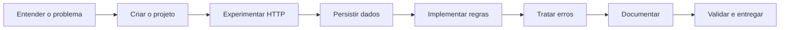

> **Solução do módulo 01** — branch `01-projeto-spring-boot-impl`. Consulte [como executar este checkpoint](SOLUCAO.md) e [a missão](docs/01-projeto-spring-boot.md). Esta branch contém código cumulativo somente até esta etapa.

# Caixa de Sugestões Etec Prefeito Alberto Feres

Uma ideia não deve desaparecer quando o servidor reinicia. Nesta trilha você vai construir uma API para cadastrar, consultar, filtrar, alterar e excluir sugestões, aprendendo HTTP, Java, Spring Boot e persistência em pequenas entregas.

## Comece aqui

1. Confira o [ambiente Windows](docs/ambiente-windows.md) ou prepare JDK 17 e Git em seu sistema. Use `java -version` e `javac -version` para conferir o JDK.
2. Leia o [modelo de dados e contrato](docs/00-modelo-dados.md).
3. Crie seu próprio projeto em uma pasta nova. A `main` contém material didático: **não há aplicação para executar aqui**.
4. Siga os módulos abaixo, evoluindo seu projeto. Não troque o projeto do aluno por um checkout da solução.

## Uma visão da jornada



## Roteiro

| Módulo | Missão | Branches |
| --- | --- | --- |
| [01-projeto-spring-boot](docs/01-projeto-spring-boot.md) | Ligar o motor | [Exercício](../../tree/01-projeto-spring-boot) · [Solução](../../tree/01-projeto-spring-boot-impl) |
| [02-api-rest](docs/02-api-rest.md) | Abrir o balcão HTTP | [Exercício](../../tree/02-api-rest) · [Solução](../../tree/02-api-rest-impl) |
| [03-postgresql-flyway-jpa](docs/03-postgresql-flyway-jpa.md) | Guardar as ideias | [Exercício](../../tree/03-postgresql-flyway-jpa) · [Solução](../../tree/03-postgresql-flyway-jpa-impl) |
| [04-casos-de-uso-crud](docs/04-casos-de-uso-crud.md) | Dar vida à caixa | [Exercício](../../tree/04-casos-de-uso-crud) · [Solução](../../tree/04-casos-de-uso-crud-impl) |
| [05-validacao-erros](docs/05-validacao-erros.md) | Conversar sobre erros | [Exercício](../../tree/05-validacao-erros) · [Solução](../../tree/05-validacao-erros-impl) |
| [06-openapi-swagger](docs/06-openapi-swagger.md) | Apresentar o contrato | [Exercício](../../tree/06-openapi-swagger) · [Solução](../../tree/06-openapi-swagger-impl) |
| [07-testes-entrega](docs/07-testes-entrega.md) | Conferir e entregar | [Exercício](../../tree/07-testes-entrega) · [Solução](../../tree/07-testes-entrega-impl) |

Depois da API: [continuação web](docs/08-continuacao-web.md), somente como roteiro futuro.

## Como funcionam as branches

Cada branch de exercício contém instruções e desafios, sem solução Java, Gradle ou SQL. Os exemplos de payload são parte do contrato. A branch com sufixo `-impl` contém a solução cumulativa até a respectiva etapa; a solução final está em `07-testes-entrega-impl`.

Você implementa cada missão no seu projeto e registra um commit ao concluir. Consulte o gabarito depois de tentar e compare responsabilidades, não apenas linhas de código. As soluções são públicas: a separação é didática, não controle de acesso.

Para consultar um checkpoint sem alterar seu trabalho, use outro clone:

```bash
git clone --branch 03-postgresql-flyway-jpa-impl https://github.com/e24Dev/CaixaDeSugestoes.git CaixaDeSugestoes-consulta
```

O comando remoto funciona depois que o professor publicar as branches. Na cópia local do professor, também é possível usar `git worktree add ../CaixaDeSugestoes-consulta 03-postgresql-flyway-jpa-impl`. Veja o [guia do professor](docs/guia-professor.md).

## Escolhas da trilha

Java 17, Spring Boot 4.1.1, Gradle 9.7.1, PostgreSQL 17, JPA/Hibernate, Flyway e Springdoc 3.1.1. A configuração fica em **application.yaml** e a aplicação usa a porta **8000**. A lista de sugestões não tem paginação.

A arquitetura separa domínio, aplicação, persistência e REST em uma única aplicação. Padrões adicionais só entram quando houver um problema concreto. Não há Spring Security, login, usuários, triagem ou interface web nesta entrega.

Cada capítulo contém missão, pré-requisitos, passos, desafio e critérios de conclusão. Anote o comando usado, resultado e explicação com suas palavras. Use apenas dados fictícios.

## Referências e preservação

A organização didática foi adaptada do [PIApi](https://github.com/F290-TP2/PIApi/tree/main/docs). O [rascunho anterior](docs/arquivo/rascunho-tutorial-original.md) foi preservado como arquivo histórico com identificação institucional atualizada: suas rotas, paginação e links não orientam esta trilha.
