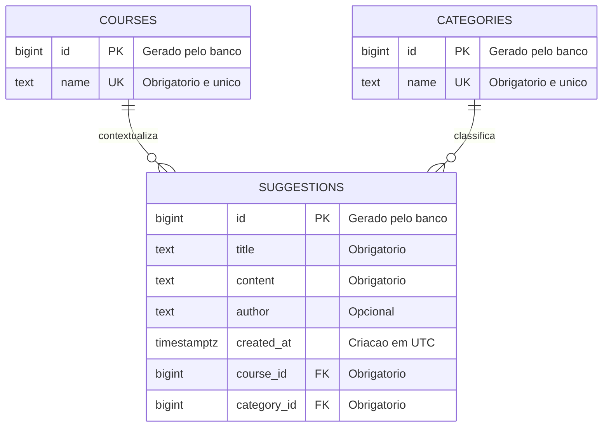
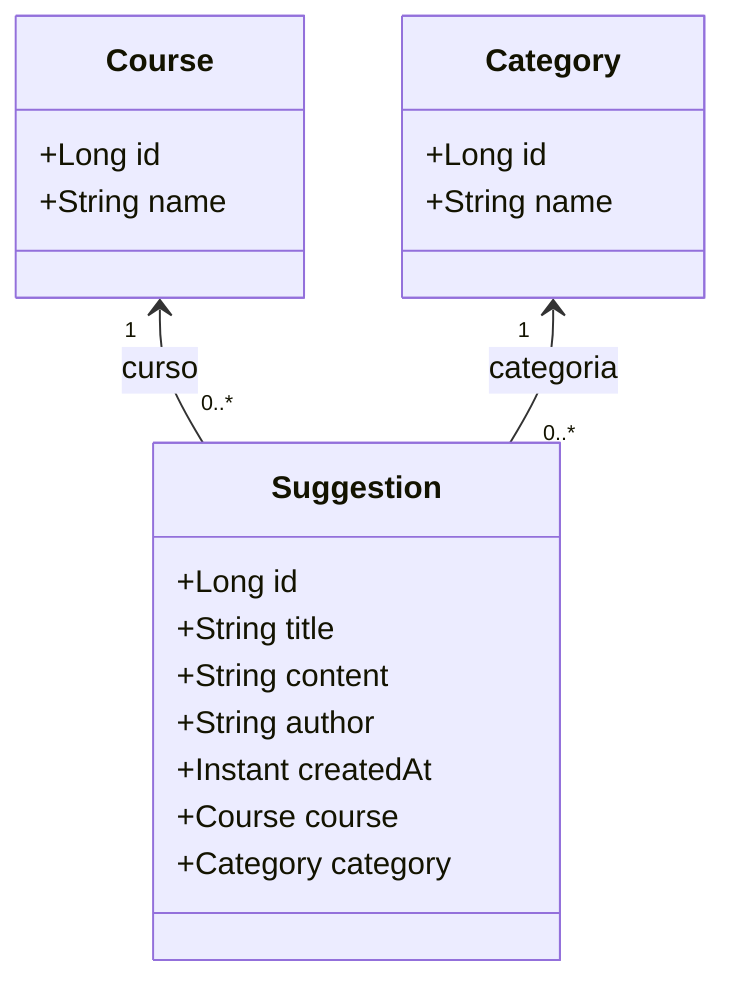
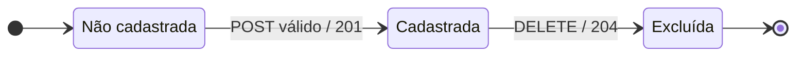
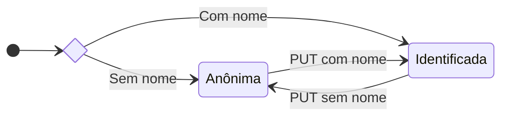
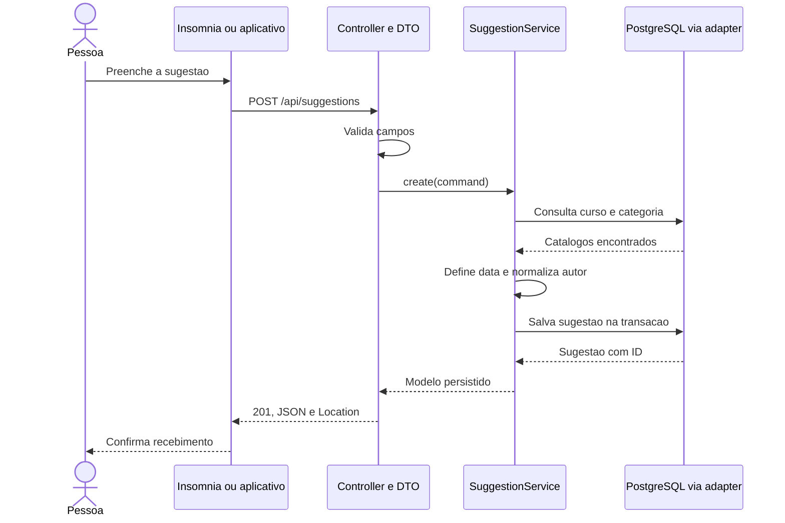

# 00 — Conhecer a caixa antes de construí-la

[Voltar ao roteiro](../README.md) · [Próxima missão: criar o projeto](01-projeto-spring-boot.md)

## Missão

Transformar ideias da comunidade da **Etec Prefeito Alberto Feres** em um modelo que o aplicativo, a API e o banco compreendam da mesma forma. Ao terminar, você saberá explicar cada campo, relação e mudança de estado antes de escrever a implementação.

## Pré-requisitos

Conhecer classes, atributos, métodos e tipos Java. A experiência com banco relacional será construída nesta trilha. Os nomes Java e JSON permanecem em inglês; explicações e mensagens são em português.

## 1. Comece por uma história

Uma pessoa percebe que faltam tomadas na biblioteca. Ela escolhe um curso e a categoria Sugestão, descreve a ideia e decide se informa seu nome. A API confere os dados, registra a criação e devolve um identificador. Depois, a ideia pode ser encontrada pelo texto, curso ou categoria.

| Pergunta do problema | Decisão no modelo |
| --- | --- |
| O que foi proposto? | title resume; content detalha |
| Quando chegou? | createdAt, atribuído pelo servidor |
| Quem escreveu? | author opcional, sem cadastro de usuário |
| A qual contexto pertence? | Um curso obrigatório |
| Que tipo de manifestação é? | Uma categoria obrigatória |
| Como consultar novamente? | id gerado pelo banco |

O nome informado é apenas um texto, não uma identidade autenticada. Não há usuários, login, curtidas ou triagem. As rotas não possuem controle de propriedade nesta versão.

## 2. Leia o diagrama entidade-relacionamento



**Como ler:** `||` significa exatamente um; `o{` significa zero ou muitos. Um curso pode existir sem sugestões. Cada sugestão precisa de exatamente um curso e uma categoria. `PK` é chave primária, `FK` é chave estrangeira e `UK` indica unicidade.

Não existe relação muitos-para-muitos neste modelo. Excluir uma sugestão não exclui curso ou categoria; não configure cascade de remoção nessas relações. A chave estrangeira impede gravar uma referência que não exista.

## 3. Consulte o dicionário de dados

### Sugestão

| Java / JSON | Coluna PostgreSQL | Tipo | Origem e regra |
| --- | --- | --- | --- |
| id | id | Long / BIGINT identity | Servidor; positivo e imutável |
| title | title | String / TEXT | Cliente; obrigatório, não só espaços |
| content | content | String / TEXT | Cliente; obrigatório, não só espaços |
| author | author | String / TEXT nullable | Cliente; opcional, remover espaços nas extremidades |
| createdAt | created_at | Instant / TIMESTAMPTZ | Servidor; UTC, preservado no PUT |
| course / courseId | course_id | Course / BIGINT FK | Cliente seleciona ID de curso existente |
| category / categoryId | category_id | Category / BIGINT FK | Cliente seleciona ID de categoria existente |

title e content preservam o texto enviado, desde que não esteja em branco. Não há limite de negócio adicional nesta versão; TEXT evita introduzir implicitamente um limite de 255 caracteres. Instant representa um instante; o JSON usa formato ISO 8601, por exemplo `2026-10-08T12:00:00Z`.

### Curso e categoria

| Campo | Tipo | Regra |
| --- | --- | --- |
| id | Long / BIGINT identity | Gerado pelo banco, positivo |
| name | String / TEXT | Obrigatório e único dentro do próprio catálogo |

Os catálogos são populados por migrations. A API oferece consultas, sem endpoints para editar ou excluir seus itens nesta entrega.

### Catálogos didáticos

| Cursos | Categorias |
| --- | --- |
| Desenvolvimento de Software Multiplataforma | Sugestão |
| Gestão Empresarial | Crítica |
| Análise e Desenvolvimento de Sistemas | Elogio |
| Administração de Empresas | — |

Esses quatro cursos preservam o conjunto de exemplos acordado para o exercício; **não são apresentados como catálogo oficial da Etec Prefeito Alberto Feres**. Cada coluna da tabela é uma lista independente: uma categoria não pertence ao curso na mesma linha. Consulte os IDs retornados pela API, sem presumir que sempre começarão em 1.

## 4. Passe das tabelas para as classes



Esses modelos pertencem ao domínio e não recebem anotações JPA. Na persistência, SuggestionEntity, CourseEntity e CategoryEntity representam as tabelas. DTOs representam o contrato HTTP. A separação permite evoluir o banco sem expor entidades diretamente ao cliente.

| Responsabilidade | Local | Exemplo |
| --- | --- | --- |
| Vocabulário e contratos de acesso | domain | Suggestion, Course, Category, SuggestionRepository |
| Coordenar operações e transações | application | SuggestionService |
| Consultar e mapear o banco | infrastructure.persistence | SuggestionPersistenceAdapter |
| Interpretar HTTP e montar JSON | interfaces.rest | SuggestionController, SuggestionRequest |

## 5. Entenda o ciclo de vida

O ciclo acompanha **uma única sugestão**, desde a criação até a exclusão. As setas mostram as operações que mudam sua existência no banco.



**Este é um ciclo conceitual, não uma coluna status.** Exclusão é física: não permanece uma linha marcada como Excluída. Um novo POST cria outra sugestão, com outra identidade.

As operações abaixo não avançam o ciclo e, por isso, ficam fora das setas:

| Operação | Resultado | Efeito no registro |
| --- | --- | --- |
| GET de sugestão cadastrada | 200 | Apenas consulta |
| PUT válido de sugestão cadastrada | 200 | Atualiza os dados; continua cadastrada |
| POST inválido | 400 ou 404, conforme a falha | Não cria registro |
| PUT inválido | 400 ou 404, conforme a falha | Preserva os dados anteriores |
| GET, PUT ou DELETE de ID excluído | 404, com entrada válida | Não recria o registro |

### Identificação opcional

Uma sugestão cadastrada pode alternar entre duas formas de identificação. O diagrama começa após um POST válido; todas as transições por PUT pressupõem uma atualização válida.



Anônima significa `author = null` no banco e `author = "Anônimo"` na resposta. Não salvar a palavra Anônimo como substituição automática no banco. “Sem nome” significa `author` ausente, nulo ou em branco. O PUT substitui os campos editáveis: omitir `author` remove o nome anterior.

Trocar um nome por outro mantém a sugestão identificada; atualizar uma sugestão sem informar nome mantém a forma anônima. Essas operações não mudam o estado representado.

## 6. Fixe o contrato HTTP

| Método e rota | Sucesso | Falhas previstas |
| --- | --- | --- |
| POST /api/suggestions | 201, objeto e Location | 400 entrada; 404 catálogo |
| GET /api/suggestions | 200, array inclusive vazio | 400 filtro inválido |
| GET /api/suggestions/{id} | 200, objeto | 400 ID; 404 sugestão |
| PUT /api/suggestions/{id} | 200, objeto atualizado | 400 entrada; 404 sugestão ou catálogo |
| DELETE /api/suggestions/{id} | 204, sem corpo | 400 ID; 404 sugestão |
| GET /api/courses | 200, array de id/name | 500 falha inesperada |
| GET /api/categories | 200, array de id/name | 500 falha inesperada |

Falhas inesperadas podem ocorrer em qualquer operação e retornam 500 genérico. Métodos e tipos de conteúdo não suportados preservam seus códigos HTTP, como 405 e 415.

### Request de criação ou atualização

```json
{
  "title": "Mais tomadas na biblioteca",
  "content": "Instalar tomadas nas mesas de estudo.",
  "author": "Pessoa Exemplo",
  "courseId": 1,
  "categoryId": 1
}
```

Os IDs são ilustrativos; substitua pelos retornados pelos catálogos. Não envie id nem createdAt como campos editáveis.

### Response de criação

```json
{
  "id": 7,
  "title": "Mais tomadas na biblioteca",
  "content": "Instalar tomadas nas mesas de estudo.",
  "author": "Pessoa Exemplo",
  "createdAt": "2026-10-08T12:00:00Z",
  "course": {"id": 1, "name": "Desenvolvimento de Software Multiplataforma"},
  "category": {"id": 1, "name": "Sugestão"}
}
```

O header Location será `/api/suggestions/7`. A consulta de lista envolve esses objetos em um array; não devolve objeto paginado.

### Filtros e ordenação

| Parâmetro | Comportamento |
| --- | --- |
| courseId | ID positivo; filtra o curso |
| categoryId | ID positivo; filtra a categoria |
| q | Trecho literal do título OU conteúdo, sem distinguir maiúsculas |

Filtros diferentes se combinam por AND. q tem espaços das extremidades removidos; vazio é ignorado. `%` e `_` são caracteres literais, não curingas. A busca não promete ignorar acentos. Um filtro por ID positivo inexistente retorna `[]`, enquanto uma referência inexistente no POST/PUT retorna 404.

Sugestões: createdAt decrescente, desempate por id decrescente. Catálogos: name crescente. Não há page, size ou filtro de status.

### Resposta de erro

```json
{
  "timestamp": "2026-10-08T12:00:00Z",
  "status": 400,
  "message": "Dados inválidos",
  "path": "/api/suggestions",
  "fieldErrors": {"title": "Título é obrigatório"}
}
```

fieldErrors é um mapa vazio quando a falha não corresponde a um campo validado. Não enviar SQL, stack trace ou credenciais na resposta.

## 7. Acompanhe uma criação



## Desafio

1. Desenhe um exemplo com dois cursos, três categorias e quatro sugestões. Pode existir categoria sem sugestão?
2. Compare autor nulo, vazio e informado. O que muda no banco e no JSON?
3. Explique por que atualizar não muda createdAt e por que excluir não apaga o curso.
4. Proponha um teste que diferencie AND entre filtros de OR entre título e conteúdo.

## Pronto quando

- Você lê as cardinalidades sem confundir tabelas com objetos.
- Explica quem define cada campo e o que o cliente pode alterar.
- Diferencia ciclo conceitual de um status persistido.
- Consegue prever os códigos HTTP nos cenários de sucesso, validação e ausência.

**Próximo passo:** [ligar o motor da aplicação](01-projeto-spring-boot.md).
