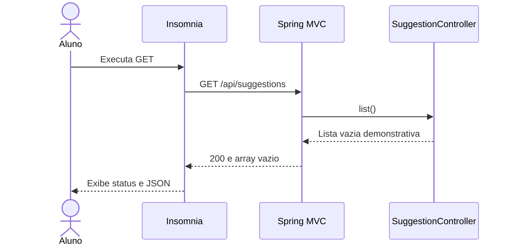

# 02 — Abrir o balcão HTTP

[Roteiro](../README.md) · [Contrato](00-modelo-dados.md)

## Missão

Definir o contrato da caixa e experimentar a primeira rota HTTP.

## Pré-requisitos

Módulo 01-projeto-spring-boot concluído no seu próprio projeto. Você continuará o seu código; a branch de exercício não fornece a solução anterior.

## Veja o caminho

## Passos

1. Leia os sete endpoints no contrato. Crie um controller REST demonstrativo para GET `/api/suggestions`, devolvendo array vazio. Ele será substituído pela consulta real no módulo 04.
2. Observe status 200, Content-Type application/json e corpo `[]`. Não simule sucesso para operações ainda não implementadas.
3. No Insomnia, crie um ambiente com `base_url` = `http://localhost:8000`, `suggestion_id`, `course_id` e `category_id`. Cadastre os sete endpoints, um filtro combinado e exemplos de erro. Use os nomes de campos do contrato.
4. Exporte sua coleção e versione-a. A coleção da branch de solução usa exportação Insomnia v4. Somente GET de sugestões funciona neste checkpoint; demais chamadas futuras podem retornar 404/405.
5. Crie um teste MockMvc que confirme status 200 e array vazio. Entenda @RestController, @RequestMapping, @GetMapping e como o Spring converte objetos Java para JSON.

**Desafio:** descreva entrada e saída do POST antes de ele existir. Compare 200, 201, 204, 400 e 404.

**Pronto quando:** GET retorna `[]`, teste passa e a coleção importa no Insomnia sem depender de autenticação.

## Registro da etapa

Execute os comandos na raiz do seu projeto. Faça um commit explicando o resultado da missão. Consulte a branch `02-api-rest-impl` em uma cópia separada somente depois de tentar; ela contém a solução até esta etapa, não a API futura.

[Próximo módulo](03-postgresql-flyway-jpa.md)
