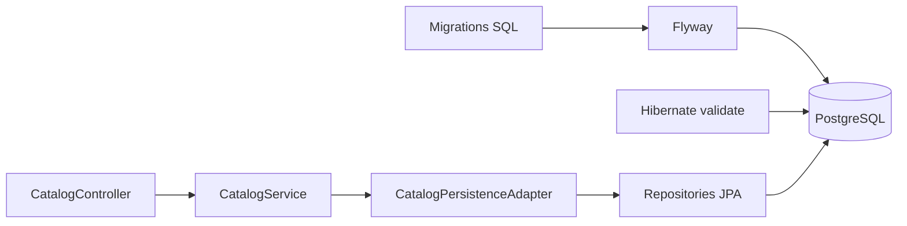

# 03 — Guardar as ideias

[Roteiro](../README.md) · [Contrato](00-modelo-dados.md)

## Missão

Criar um banco reproduzível e consultar os catálogos com JPA.

## Pré-requisitos

Módulo 02-api-rest concluído no seu próprio projeto. Você continuará o seu código; a branch de exercício não fornece a solução anterior.

## Veja o caminho

## Passos

1. Instale/inicie Docker e configure um serviço PostgreSQL 17 com database `caixa_sugestoes`, usuário `caixa`, senha local `caixa` e porta 5432. Use volume nomeado para preservar dados. Alternativa: crie banco e usuário em um PostgreSQL já instalado.
2. Acrescente starters de Data JPA e Flyway, driver PostgreSQL, módulo Flyway PostgreSQL e Lombok (compileOnly e annotationProcessor). Remova H2/MySQL/MongoDB se selecionados no gerador.
3. No application.yaml configure `spring.datasource.url`, `username` e `password` com placeholders DB_URL, DB_USERNAME e DB_PASSWORD e defaults locais. Configure `spring.jpa.hibernate.ddl-auto: validate`, `spring.jpa.open-in-view: false` e `spring.flyway.enabled: true`.
4. Crie V1__create_tables.sql em `src/main/resources/db/migration`: as três tabelas, identity IDs, text, timestamptz, campos obrigatórios, nomes únicos e chaves estrangeiras. Crie V2__seed_catalogs.sql com os quatro cursos e três categorias. Não edite migrations já aplicadas; crie uma nova para evoluir.
5. Separe modelos de domínio de entidades JPA. Entidades ficam em infrastructure.persistence com @Entity, @Table e @Id. Use @ManyToOne para curso/categoria, sem cascade de remoção, e repositories Spring Data. Explique lazy loading e por que mapear dentro da transação.
6. Implemente consulta dos catálogos usando interfaces de domínio, adapters e um serviço de aplicação. Controllers devolvem DTOs com id e name, ordenados por nome.
7. Inicie o banco e depois a API. Consulte GET `/api/courses` e `/api/categories`. Confira flyway_schema_history e reinicie: continuam quatro cursos e três categorias.
8. Adicione testes com PostgreSQL Testcontainers. Configure Docker antes de executá-los. Nunca introduza H2 para esconder uma incompatibilidade com PostgreSQL.

**Desafio:** explique por que ddl-auto validate complementa Flyway e não cria tabelas.

**Pronto quando:** migrations executam em banco vazio, schema é validado, catálogos retornam seeds e testes passam. GET de sugestões ainda é demonstrativo.

## Registro da etapa

Execute os comandos na raiz do seu projeto. Faça um commit explicando o resultado da missão. Consulte a branch `03-postgresql-flyway-jpa-impl` em uma cópia separada somente depois de tentar; ela contém a solução até esta etapa, não a API futura.

[Próximo módulo](04-casos-de-uso-crud.md)
