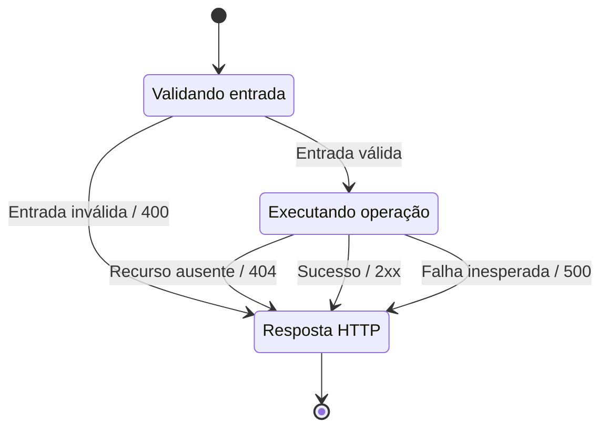

# 05 — Conversar sobre erros

[Roteiro](../README.md) · [Contrato](00-modelo-dados.md)

## Missão

Rejeitar entradas inválidas e explicar os erros de forma previsível.

## Pré-requisitos

Módulo 04-casos-de-uso-crud concluído no seu próprio projeto. Você continuará o seu código; a branch de exercício não fornece a solução anterior.

## Veja o caminho

O diagrama resume os resultados tratados neste módulo. Cada requisição produz uma única resposta; uma correção do cliente inicia outra requisição.

“Recurso ausente” inclui a sugestão consultada por ID e as referências de curso ou categoria exigidas na escrita. Uma listagem sem resultados retorna **200 com `[]`**. Falhas inesperadas também podem ocorrer durante a validação e retornam 500; erros de protocolo preservam códigos como 405 e 415.

## Passos

1. Adicione Validation. Marque title/content com @NotBlank, courseId/categoryId com @NotNull e @Positive; use @Valid no request body.
2. Valide IDs de rota e filtros. Não trate ausência de recurso como IllegalArgumentException: use uma exceção específica de não encontrado.
3. Crie @RestControllerAdvice com respostas uniformes: timestamp, status, message, path e fieldErrors. Converta falhas de Bean Validation e corpo JSON em 400, recurso inexistente em 404 e exceção inesperada em 500.
4. Garanta que o tratamento genérico não transforme métodos HTTP não suportados e outros erros de protocolo em 500. Preserve o status apropriado.
5. Não exponha stack trace, SQL ou dados de conexão na resposta. Registre a exceção inesperada no log para diagnóstico.
6. Faça testes de controller para corpo vazio, whitespace, IDs inválidos, JSON truncado, categoria inexistente e sugestão inexistente. Confira as mensagens por campo.

**Desafio:** explique a diferença entre courseId negativo (400), referência inexistente no POST (404) e filtro positivo sem resultados (200 com []).

**Pronto quando:** erros têm formato consistente e nenhuma falha de validação retorna 500.

## Registro da etapa

Execute os comandos na raiz do seu projeto. Faça um commit explicando o resultado da missão. Consulte a branch `05-validacao-erros-impl` em uma cópia separada somente depois de tentar; ela contém a solução até esta etapa, não a API futura.

[Próximo módulo](06-openapi-swagger.md)
