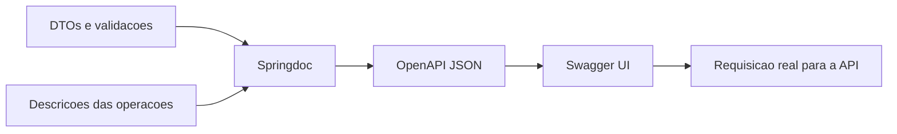

# 06 — Apresentar o contrato

[Roteiro](../README.md) · [Contrato](00-modelo-dados.md)

## Missão

Permitir que outra dupla descubra a API pelo navegador.

## Pré-requisitos

Módulo 05-validacao-erros concluído no seu próprio projeto. Você continuará o seu código; a branch de exercício não fornece a solução anterior.

## Veja o caminho

## Passos

1. Adicione `org.springdoc:springdoc-openapi-starter-webmvc-ui:3.1.1`, compatível com Spring Boot 4. Configure `/swagger-ui.html` e `/v3/api-docs` no YAML.
2. Defina título, versão e objetivo da API. Documente sugestões e catálogos com tags, operações e descrições legíveis.
3. Anote schemas dos DTOs com descrições e exemplos. Documente author opcional, criação UTC e curso/categoria como objetos na resposta.
4. Descreva filtros, ordenação, array sem paginação, payloads e códigos de sucesso/erro em cada endpoint. Não anuncie 401/403 ou botão Authorize: não há segurança nesta versão.
5. Use Try it out para consultar catálogos e criar uma sugestão com os IDs retornados. Confira o documento JSON e a coleção Insomnia.

**Desafio:** outra dupla deve criar e filtrar uma sugestão usando somente Swagger. Corrija qualquer informação que ela precisar perguntar.

**Pronto quando:** todos os sete endpoints, DTOs e respostas de erro estão documentados e executáveis no navegador.

## Registro da etapa

Execute os comandos na raiz do seu projeto. Faça um commit explicando o resultado da missão. Consulte a branch `06-openapi-swagger-impl` em uma cópia separada somente depois de tentar; ela contém a solução até esta etapa, não a API futura.

[Próximo módulo](07-testes-entrega.md)
