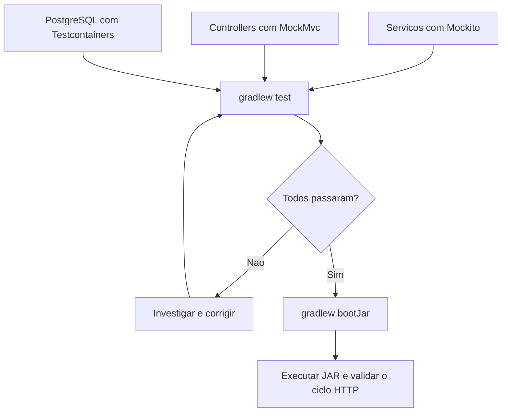

# 07 — Conferir e entregar

[Roteiro](../README.md) · [Contrato](00-modelo-dados.md)

## Missão

Verificar o contrato, empacotar a aplicação e demonstrar persistência.

## Pré-requisitos

Módulo 06-openapi-swagger concluído no seu próprio projeto. Você continuará o seu código; a branch de exercício não fornece a solução anterior.

## Veja o caminho

## Passos

1. Execute `./gradlew test` com Docker iniciado (Windows: `.\gradlew.bat test`). Testes unitários isolam serviços com Mockito; MockMvc verifica HTTP; Testcontainers testa PostgreSQL real.
2. Cubra CRUD, anonimato, filtros isolados/combinados, texto literal, lista vazia, ordenação e data preservada. Verifique migrations e os sete seeds. Não pule integração silenciosamente se Docker estiver ausente.
3. Execute `./gradlew bootJar` e rode o JAR produzido em build/libs com `java -jar`. O nome depende da versão definida no build.gradle.
4. Suba PostgreSQL com `docker compose up -d --wait`. Confirme Swagger em `http://localhost:8000/swagger-ui.html` e JSON em `/v3/api-docs`.
5. Use a coleção para criar, consultar e editar. Reinicie a aplicação e confira o registro. Exclua-o e confira 404 na consulta seguinte.
6. Revise README, comandos, links, YAML e ausência de secrets reais. `docker compose down` para os containers; não use `down -v` se quiser preservar o banco.

**Desafio:** apresente uma sugestão anônima, uma identificada, um erro previsto e a prova de persistência após reinício. Explique o caminho completo controller → serviço → adapter → banco.

**Pronto quando:** testes passam, JAR inicia, contrato documentado coincide com JSON real e um colega reproduz a execução sem ajuda.

## Registro da etapa

Execute os comandos na raiz do seu projeto. Faça um commit explicando o resultado da missão. Consulte a branch `07-testes-entrega-impl` em uma cópia separada somente depois de tentar; ela contém a solução até esta etapa, não a API futura.

[Continuação web](08-continuacao-web.md)
