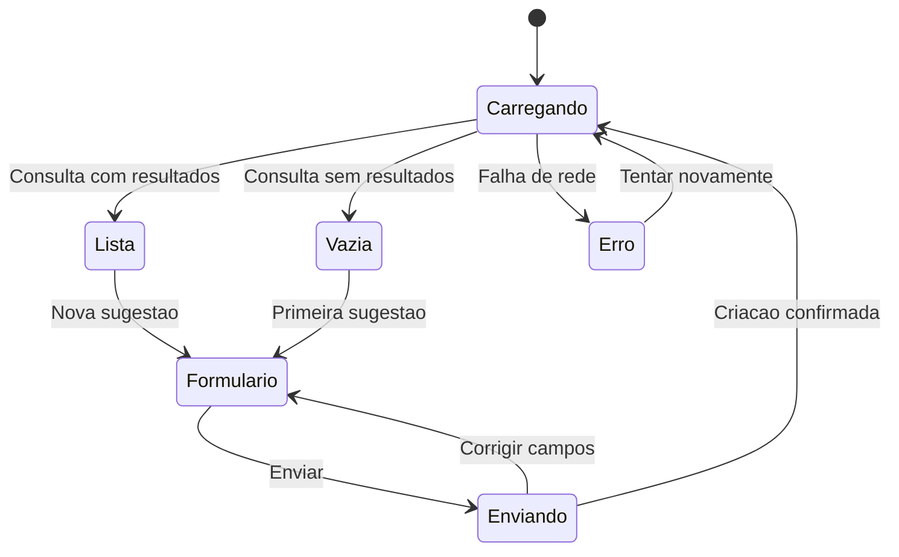

# Continuação — uma interface para a caixa

Esta é uma proposta futura, sem implementação ou branch -impl nesta entrega.

## Missão

Planejar uma interface que consuma o contrato pronto: listar/filtrar sugestões, consultar detalhe e cadastrar uma sugestão anônima ou identificada.

## Pré-requisitos

API validada e Swagger disponível. A tecnologia da interface será definida numa etapa futura; este roteiro não instala Thymeleaf nem framework frontend.

## Veja o caminho

## Passos

1. Desenhe a lista, os filtros e o formulário com curso e categoria vindos dos catálogos.
2. Preveja carregamento, lista vazia, sucesso, erro por campo e falha de rede.
3. Separe chamadas HTTP da apresentação; use o contrato da API sem duplicar regras de persistência.

## Desafio

Peça a um colega que encontre uma sugestão pelo curso e proponha uma nova sem explicar o desenho.

## Pronto quando

A jornada e os estados estão descritos. Login, segurança e implementação da interface exigirão planejamento próprio.
